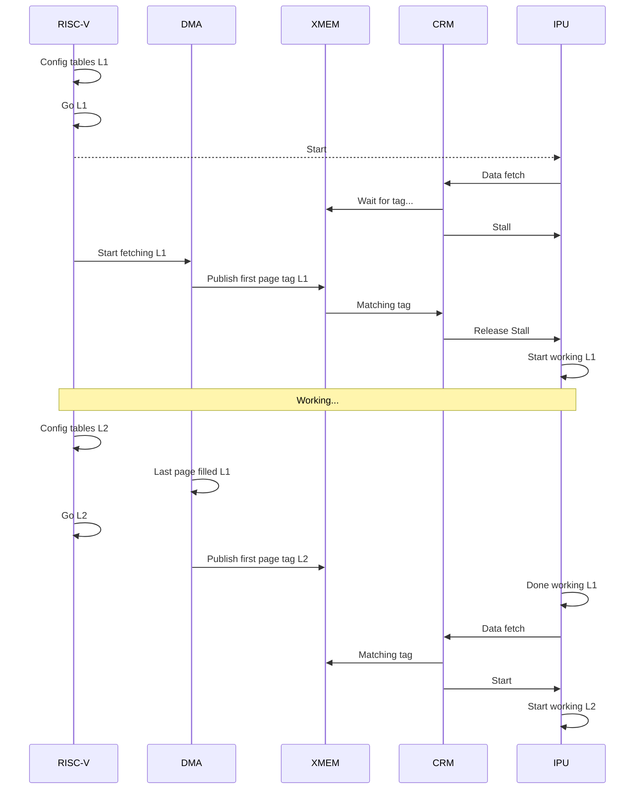

# Cache Unit

## 1. Purpose

The Cache Unit manages data movement between external DRAM and on-chip XMEM so the IPU can run continuously.

- CRM resolves IPU addresses and checks tags.
- DMA moves data between DRAM and XMEM using DMA tables.
- XMEM stores active banks/pages used by IPU.

## 2. Block Diagram

```text
+----------------------------------------------+
|                 CACHE UNIT                   |
|                                              |
|   +------+      +------+      +------+       |
|   | DMA  |<---->| XMEM |<---->| CRM  |       |
|   +------+      +------+      +------+       |
|      ^                          ^            |
+------|--------------------------|------------+
       |                          |
   dram_addr                ipu_addr, table_id
   (DRAM)                        (IPU)
```

## 3. Interfaces

| Name | Type and Direction | Description |
|------|--------------------|-------------|
| `riscv_cfg_bus` | `input logic [TBD:0]` | Config bus from RISC-V for table setup and start signals. |
| `dram_addr` | `output logic [TBD:0]` | Address to DRAM controller. |
| `dram_rd_data` | `input logic [7:0] [XMEM_ROW_WIDTH-1:0]` | Read data from DRAM (array of bytes). |
| `dram_rd_metadata` | `input logic [META_DATA_WIDTH-1:0]` | Metadata read from DRAM. |
| `dram_wr_data` | `output logic [7:0] [XMEM_ROW_WIDTH-1:0]` | Write data to DRAM (array of bytes). |
| `dram_wr_metadata` | `output logic [META_DATA_WIDTH-1:0]` | Metadata written to DRAM. |
| `ipu_addr` | `input logic [ARRAY_ID_WIDTH+OFFSET_WIDTH-1:0]` | IPU virtual address (`array_id + offset`). |
| `ipu_rd_data` | `output logic [7:0] [XMEM_ROW_WIDTH-1:0]` | Data returned to IPU (array of bytes). |
| `ipu_rd_metadata` | `output logic [META_DATA_WIDTH-1:0]` | Metadata returned to IPU. |
| `ipu_wr_data` | `input logic [7:0] [XMEM_ROW_WIDTH-1:0]` | Data written by IPU to XMEM (array of bytes). |
| `ipu_wr_metadata` | `input logic [META_DATA_WIDTH-1:0]` | Metadata written by IPU to XMEM. |

## 4. Parameters

| Name | Default | Description |
|------|---------|-------------|
| `NUM_BANKS` | `16` | Number of XMEM banks/pages. |
| `BANK_DATA_SIZE` | `1024 rows x 1024 bits = 128KB` | Size of one BANK/PAGE. |
| `OFFSET_WIDTH` | `20` | Offset width inside the array address space. |
| `ARRAY_ID_WIDTH` | `4` | Array ID width. |
| `XMEM_ROW_WIDTH` | `128` | Width of one XMEM row (bytes). |
| `META_DATA_WIDTH` | `16` | Width of metadata carried alongside row data (bits): 8-bit scale, 1-bit sign/unsign, 4-bit exponent format, 3-bit mantissa format. |

### 4.1 XMEM Bank Property

Each XMEM bank carries the following per-bank state, in addition to its data rows.

| Field | Width (bits) | Description |
|-------|--------------|-------------|
| `tag` | 14 | `{TABLE_ID, offset[19:10]}`. `FFFF` means the bank is free or not ready for the required operation. |
| `table_id` | 4 | Table currently owning this bank. |
| `flush` | 1 | When `True`, this bank is ready to be written to DRAM. |

## 5. Tables

A table is a data structure that defines the methodology of a data movement and holds all the parameters needed for the task.

**Table properties:**

| Field | Width (bits) | Description |
|-------|--------------|-------------|
| `table_id` | 4 | Table ID sent with the IPU address. |
| `type` | 2 | `read_only`, `write_only`, `read_after_write`, `scratch_pad`. reletive to IPU | 
| `dram_base_address` | 32 | Resolution of `BANK_DATA_SIZE`. |
| `size` | 16 | Resolution of `BANK_DATA_SIZE`. |
| `xmem_bank_list[16]` | 4 | Ordered array of banks. |
| `xmem_num_of_banks` | 4 | Amount of banks. |
| `jump_back` | 16 | Flush all addresses that are below `table_addr - jump_back`. Actual flush is done for the entire bank, not per address. When accessing `table_addr < jump_back`, flush all table banks to prepare for another round of table traversing. |
| `repetitions` | 16 | Number of times to read the table. Used to invalidate banks (using `jump_back`) on the last round of the read. |

### 5.1 Table Types

- `read_only` — Table data is loaded from DRAM into XMEM. Once the IPU has finished reading the table, all of its bank tags are invalidated.
- `write_only` — Table data is written from XMEM to DRAM. Once all of the table's data has been written to DRAM, all of its bank tags are invalidated.
- `read_after_write` — Table data is written by the IPU into XMEM and stays valid until it has been read back; only then are its bank tags invalidated.
- `scratch_pad` — Table data stays resident in XMEM for as long as the layer is executing on the IPU. Its bank tags are invalidated only when the currently executing kernel finishes.

## 6. Memory and Tag Model

- Tag = {TABLE_ID, offset[19:10]}
- In this design, **BANK = PAGE**.
- Each BANK/PAGE has **1024 rows**.
- Each row is **1024 bits**.
- Each row contains metadata (`META_DATA_WIDTH` = 16 bits) alongside its data:
  - `scale[15:8]` = 8-bit scale
  - `sign/unsign[7]` = 1-bit sign/unsign (`0` = unsigned, `1` = signed)
  - `fe[6:3]` = 4-bit exponent format
  - `fm[2:0]` = 3-bit mantissa format
- Address split:
  - `offset[9:0]` = row index in bank (0..1023)
  - `offset[19:10]` = tag and bank-list index component
- `FFFF` tag means bank is free or not ready for the required operation.

## 7. Handshake Model

- IPU and DMA are not directly connected — they synchronize only through per-bank
  `tag`/`flush` state in XMEM (Section 4.1).
- IPU sends two things to CRM:
   - `ipu_addr` (virtual address)
   - Requested table ID — symbolic table names (e.g. `W_Table`, `Xout_Table`) are
     assigned a numeric `table_id` (0-15) at compile time.
- CRM computes `bank_pos`/`tag` from the address and checks it against the bank's
  current `tag`. If they don't match, CRM stalls the IPU.
- **Read path:** DMA runs in the background, waits for a free bank (`tag == FFFF`),
  fills it from DRAM, and publishes `bank.tag` when done. Once the published tag
  matches what CRM is checking for, CRM releases the stall.
- **Write path:** the IPU claims free banks ahead of writing (Section 9.2, thread 0)
  and writes into them. When a jump boundary is crossed, CRM marks the *previous*
  bank `flush = True` instead of invalidating its tag immediately. DMA drains
  flushed banks to DRAM (Section 8.2) and clears the bank (`tag = FFFF`,
  `flush = False`) once the drain completes.

## 8. DMA Operations

- `banklist` is a cyclic linked list.
- `repetitions` is the num of time this table must be loaded from dram during its lifetime.
- `dram_base_address` is the DRAM base address used for this table's operations.

DMA can only handel write_only/read only table 

### 8.1 DMA Read (DRAM -> XMEM)

```text

dram_addr = dram_base_address + dram_offset
bank_pos = dram_offset[19:10] % NUM_BANKS
bank = banklist[bank_pos]
xmem_addr = {bank, dram_offset[9:0]}
tag = {TABLE_ID, dram_offset[19:10]}

if (bank.tag != FFFF)
   DMA_stall

if (done_filling_bank)
   bank.tag = tag
   bank.table_id = TABLE_ID

```

Behavior:
- DMA cannot overwrite a busy bank (`bank.tag != FFFF`).
- Tag is published only after the whole bank is filled.

### 8.2 DMA Write (XMEM -> DRAM)

```text

dram_addr = base_dram_addr + dram_offset
bank_pos = dram_offset[19:10] % NUM_BANKS
bank = banklist[bank_pos]
tag = {TABLE_ID, dram_offset[19:10]}

if (bank.tag != tag and bank.flush == False)
     DMA_stall

if (dram_offset[9:0] == 0x3FF)   // row 1023
   bank.tag = FFFF
   bank.flush = False
 

```

Behavior:
- DMA drains bank data to DRAM only when bank tag matches required tag.
- At row 1023, drain is complete and bank is released (`FFFF`).

## 9. CRM Operations

### 9.1 IPU Read (XMEM -> IPU)

```text
// IPU request carries: IPU_ADDR (virtual) + TABLE_ID

bank_pos = offset[19:10] % NUM_BANKS
bank = banklist[bank_pos]
xmem_addr = {bank, offset[9:0]}
tag = {TABLE_ID, offset[19:10]}

if (tag != bank.tag or bank.table_id != TABLE_ID)
   IPU_stall

if (offset[9:0] >= jump_back && offset[19:10] != 0)
   banklist[(bank_pos - 1) % NUM_BANKS].tag = FFFF

if (offset == FFFF)
   for bank in banks:
      bank.tag = FFFF
```

Behavior:
- CRM can free previous bank at jump boundary.

### 9.2 IPU Write (IPU -> XMEM)

```text

thread 0
while (i != array_size):
   bank_pos = i % NUM_BANKS
   bank = banklist[bank_pos]
   if(bank.tag == FFFF)
      bank.tag = i
      bank.table_id = TABLE_ID
      i++
      
thread 1
bank_written_counter = 0 
bank_pos = offset[19:10] % NUM_BANKS
bank = banklist[bank_pos]
tag = {TABLE_ID, offset[19:10]}

if (tag != bank.tag or bank.table_id != TABLE_ID)
   IPU_stall

if (offset[9:0] >= jump_back && offset[19:10] != 0 )
   banklist[(bank_pos - 1) % NUM_BANKS].flush = True
   bank_written_counter++ 

if (offset == FFFF && bank_written_counter == size)
   for bank in banklist:
      if(bank.tag != FFFF)
         bank.flush = True

```

Behavior:
- CRM table provides `banklist` (linked list) and `jump_back` (numeric value).

## 10. Layer1/Layer2 Timing Example




