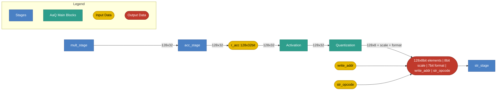

# AaQ and Store Stage

## 1. Purpose

This spec covers two consecutive VLIW pipeline stages: **AaQ**
(Activation and Quantization) and **STR** (Store), which write AaQ's
output to external memory. AaQ is sections 1-6 below; STR is section 7.

The AaQ (Activation and Quantization) stage applies element-wise activation
and special functions to the 128-element accumulator, and quantizes the
128-element vector into an 8-bit vector for output. It produces:

- A 128-element vector of 8-bit quantized values.
- A scale factor.
- A format field.

## 2. Block Diagram



## 3. Interfaces

### 3.0 Black Box Diagram

```
                         ┌──────────────────────────────────────┐
              clk  ─────>│                                      │
              rst  ─────>│                                      │
               op  ─────>│                                      │
            r_acc  ─────>│                                      │
    function_type  ─────>│             AaQ Stage                ├────> to STR stage
 invalid_elements  ─────>│                                      │      [128×8b elements | 8b scale | 7b format
        partition  ─────>│                                      │       | write_addr | str_opcode]
   partition_mask  ─────>│                                      │
           format  ─────>│                                      │
        quan_mode  ─────>│                                      │
       write_addr  ─────>│                                      │
       str_opcode  ─────>│                                      │
                         └──────────────────────────────────────┘
```


### 3.1 Inputs

| Name | Type and Direction | Description |
|------|--------------------|-------------|
| `clk` | `input logic` | Clock signal. |
| `rst` | `input logic` | Synchronous reset. |
| `op` | `input logic [0:0]` | Selects the AaQ operation: `AAQ_INST_OPCODE_NOP` = 0, `AAQ_INST_OPCODE_ACTIVATE_QUANTIZE` = 1. |
| `r_acc` | `input logic [127:0][31:0]` | 128-element accumulator (128 × 32-bit FP32). |
| `function_type` | `input logic [2:0]` | Encoded activation/special-function selector for `ACTIVATE.QUANTIZE` (see section 5.0). |
| `invalid_elements` | `input logic [6:0]` | Element count. |
| `partition` | `input logic [1:0]` | Element partition grouping: enum of `1`/`2`/`4`/`8` (encoded `00`/`01`/`10`/`11`). Exact semantics TBD. |
| `partition_mask` | `input logic [2:0]` | Count of `partition` groups, counted from the right (highest-indexed group), that are masked out entirely. `0` = all `partition` groups valid; `k` = the rightmost `k` groups are masked — their elements do not participate in activation/quantization and their `aaq_out` elements are forced to 0 (section 6.2). `k` must not exceed `partition - 1` (masking every group is not a supported configuration). Example: `partition = 8` splits the 128 elements into 8 groups of 16 (`elements[0:15] \| elements[16:31] \| ... \| elements[112:127]`); `partition_mask = 2` masks the rightmost 2 groups, i.e. `elements[96:127]`. |
| `format` | `input logic [6:0]` | Output element format, replacing the old fixed `dtype`: bit `[6]` = sign (`0`=unsigned, `1`=signed), bits `[5:3]` = exponent bits (3 bits), bits `[2:0]` = mantissa bits (3 bits). |
| `quan_mode` | `input logic` | Scale-factor mode: `1` = dynamic, `0` = static. |
| `write_addr` | `input logic [XMEM_ADDR_W-1:0]` | Destination XMEM address for the quantized result (see `XMEM_ADDR_W` in the Control stage spec, section 4). Received here and passed through to the STR stage. |
| `str_opcode` | `input logic [0:0]` | The STORE slot's opcode (`STORE_INST_OPCODE_STR_POST_AAQ_REG` = 0, `STORE_INST_OPCODE_NOP` = 1; see section 7.1). Received here and passed through to the STR stage. |

*`op` is sourced from the `opcode` field of the generated `aaq_slot_t` struct, typed `aaq_inst_opcode_t` (package `ipu_instr_pkg`). Generated from [`instruction_spec.py`](../../../src/tools/ipu-common/src/ipu_common/instruction_spec.py) (the AAQ slot's `"aaq"` entry) by [`gen_codegen.py`](../../../src/tools/ipu-as-py/src/ipu_as/gen_codegen.py) via the [`ipu_instr_pkg.sv.j2`](../../../src/tools/ipu-as-py/src/ipu_as/templates/ipu_instr_pkg.sv.j2) template (`bazel run //src/tools/ipu-as-py:ipu-as -- sv-package --output <path>`).*

### 3.2 Output

The Quantization block passes the following payload to the **STR stage**, which performs the actual XMEM write; AaQ itself does not write to XMEM.

| Field | Width | Description |
|-------|-------|-------------|
| `aaq_out` | 1024 + 8 + 7 = 1039 bits | Bundled output data (see section 5.1/6.2): 128 × 8-bit quantized elements, 8-bit scale factor, and 7-bit format (matching the `format` input width, section 3.1: 1 sign + 3 exponent + 3 mantissa). |
| `write_addr` | `[XMEM_ADDR_W-1:0]` | Passed through unchanged from the `write_addr` input (section 3.1). |
| `str_opcode` | `1 bit` | Passed through unchanged from the `str_opcode` input (section 3.1). |

Total payload width: 1039 + 1 = 1040 bits, plus `write_addr` (`XMEM_ADDR_W` bits).

## 4. Disclaimers

- The AaQ slot executes once per VLIW cycle.
- The STR slot executes once per VLIW cycle; STR is the pipeline's last stage.
- Slot execution order within a VLIW word: CTRL → MULT → ACC → **AaQ** → **STR**.
- `NOP` performs no state changes, in either the AaQ or STR slot.

## 5. AaQ Operations

### 5.0 Activate and Quantize (`ACTIVATE.QUANTIZE`)

Activation and quantization happen in a single instruction; there is no
separate activate-only or quantize-only instruction. It applies an
element-wise activation function to every element of `r_acc`.

The function is selected via `function_type` and applied directly to the
FP32 elements. Functions besides `relu`,
`relu6`, and `identity` are loaded into the LUT; functions called by name `exp2`,`rsqrt`, `reciprocal`, or `activation`, require the function to be
present in the LUT.

```text
for i in 0..127:
    case function_type:
        identity:    activated[i] = r_acc[i]
        relu:        activated[i] = max(0, r_acc[i])
        relu6:       activated[i] = min(max(0, r_acc[i]), 6)
        reciprocal:  activated[i] = (r_acc[i] == 0) ? 0 : LUT[function_type](r_acc[i])
        rsqrt:       activated[i] = (r_acc[i] <= 0) ? 0 : LUT[function_type](r_acc[i])
        exp2:        activated[i] = LUT[function_type](r_acc[i])
        activation:  activated[i] = LUT[function_type](r_acc[i])
```

Supported function types: activation and special functions grouped onto a
single field:


| Encoding | Name | Formula | Notes |
|----------|------|---------|-------|
| 1 | `identity` | `f(x) = x` | Pass-through; no transform. |
| 2 | `relu` | `f(x) = max(0, x)` | Most common non-linearity. |
| 3 | `relu6` | `f(x) = min(max(0, x), 6)` | Clipped ReLU; used in MobileNet. |
| 4 | `activation` | - | Covers all activations except `relu` and `relu6`: `sigmoid`, `tanh`, `gelu`, `softplus`, `elu`, `silu`. |
| 5 | `reciprocal` | `f(x) = 1/x` (0 if x = 0) | Multiplicative inverse; useful for normalization. |
| 6 | `rsqrt` | `f(x) = 1/√x` (0 if x ≤ 0) | Reciprocal square root; used in layer normalization. |
| 7 | `exp2` | `f(x) = 2^x` | Used for dequantization, softmax and attention scaling. |

### 5.1 Quantization Algorithm

After activation (section 5.0), each activated FP32 element `a` (IEEE-754 single
precision: 1-bit sign `S`, 8-bit exponent `e`, 23-bit mantissa) is quantized
to the format selected by `format` (section 3.1): sign bit present only if
`format[6] = 1` (signed; omitted when unsigned) + `fe` exponent bits
(`format[5:3]`) + `fm` mantissa bits (`format[2:0]`). `fe` and `fm` are
independent fields, not derived from one another, so `sign + fe + fm` is not
required to total 8 bits; when it is smaller, the leftover high-order bits
of the 8-bit quantized element are zero-padded. `fe` is at minimum 1 bit;
`fm` may be 0 bits. FP32 inputs are always treated as normalized (implicit
leading 1); subnormal inputs are not specially handled.

The scale factor `s` (8 bits, `e8m0`: exponent only, no mantissa) is the
batch's shared scale, computed as the maximum raw exponent across the 128
elements of the batch, before quantization:

```text
s = max(e[i] for i in 0..127)
```

For each element, define the exponent distance from the batch scale:

```text
E = -(e - s)   // = s - e
```

Since `s` is the batch maximum, `E >= 0` for every element, with `E = 0` at
the batch-max element(s) and `E` growing as an element's magnitude shrinks
relative to the batch max. The output exponent and mantissa fields are then:

```text
if 0 <= E <= 2^fe - 1:               // representable directly in fe bits
    Exp = E
    M   = RTN(1.M)                   // round the 23-bit mantissa (implicit leading 1) to fm bits
else:                                  // E exceeds what fe bits can represent
    Exp = 2^fe - 1                    // exponent field saturates at its max value
    M   = RTN(1.M >> [E - (2^fe - 1) + 1])  // extra right-shift preserves magnitude instead of flushing to zero
```

`RTN` = round to nearest. Sign `S` (when present, `format[6] = 1`) is passed
through unchanged. The final 8-bit quantized element is
`{0-pad, S?, Exp, M}`: `S`, `Exp` (`fe` bits), and `M` (`fm` bits) packed at
the low end, zero-padded at the high end to fill 8 bits. The output payload
also carries `Format` (passed through unchanged from the `format` input) and
the batch `Scale` (`s`), as described in section 3.2.

> **Note:** the `S`/`Exp`/`M` encoding above is the same for both
> `quan_mode` values, and `s` is computed the same way (batch max, as shown
> above) regardless of `quan_mode`. `quan_mode = 1` (dynamic) restricts
> `format` to exactly two supported formats, both signed: `e2m5` and
> `e1m6`. How the hardware chooses between `e2m5` and `e1m6` in dynamic
> mode is **TBD**.

## 6. ISA-AaQ: Instruction Reference

The opcode enum
(`aaq_inst_opcode_t`, package `ipu_instr_pkg`) is generated from
[`instruction_spec.py`](../../../src/tools/ipu-common/src/ipu_common/instruction_spec.py)
by [`gen_codegen.py`](../../../src/tools/ipu-as-py/src/ipu_as/gen_codegen.py).

The AaQ slot is resolved by CTRL and forwarded down the pipeline;
the stage does not read the CR/LR register files itself (see the
Control Stage spec, section 5). The active element count is determined by each
instruction's mandatory `cr_idx` operand together with `partition_mask`
(section 3.1): `masked = partition_mask * (128 / partition)` elements are
excluded from the right, so `n = min(invalid_elements, 128 - masked)`
at cycle start. There is no implicit default register; `cr_idx` must always
be named explicitly (any `CR0`-`CR15`; `CR15` remains the conventional choice
but is never assumed).

### 6.1 `NOP`: No Operation

- **Summary:** No operation for the AaQ slot; performs no state changes.
- **Syntax:** `NOP`
- **Operands:** none.

### 6.2 `ACTIVATE.QUANTIZE`: Activate and Quantize

- **Summary:** Apply an element-wise activation function to the active elements of `r_acc`, quantize the result, and write the resulting 8-bit values, scale factor, and format into `aaq_out` (pseudocode name for AaQ's output data bundle; the concrete storage/register implementation is left to the designer). Activation functions are pre-configured into a LUT; naming an activation in `function_type` triggers the corresponding loaded LUT entry. `r_acc` is not modified.
- **Syntax:** `ACTIVATE.QUANTIZE function_type, cr_idx`
- **Operands:**
  - `function_type`: activation/special-function keyword (see section 5.0): `identity`, `relu`, `relu6`, `activation`, `reciprocal`, `rsqrt`, `exp2`.
  - `cr_idx`: `CR0`…`CR15`, dstructure register supplying `valid_elements` (must be given explicitly; no implicit default).
- **Operation:**
  ```text
  masked = partition_mask * (128 / partition)          // section 3.1
  n = min(invalid_elements, 128 - masked)
  for i in 0..n-1:
      activated[i] = LUT[function_type](r_acc[i])     // section 5.0
      aaq_out.elements[i] = quantize(activated[i])     // section 5.1
  aaq_out.elements[n..127] = 0
  aaq_out.scale = s                                    // section 5.1
  aaq_out.format = format
  ```
- **Example:** `ACTIVATE.QUANTIZE relu, CR15;;`

### 6.3 Summary Table

| Slot | Mnemonic | Operands | One-line Effect |
|------|----------|----------|-----------------|
| AaQ | `NOP`               | -                       | no state change |
| AaQ | `ACTIVATE.QUANTIZE` | `function_type, cr_idx` | `aaq_out.elements[0..n-1] = quantize(LUT[function_type](r_acc[i]))`, `aaq_out.scale/format` set, n = min(invalid_elements, 128 - partition_mask * (128/partition)) |

## 7. STR (Store) Stage

### 7.0 Purpose

STR is the pipeline's last stage; it store `aaq_out` (AaQ's output data,
written by `ACTIVATE.QUANTIZE`, section 6.2) to external memory. Slot execution order within
a VLIW word: CTRL → MULT → ACC → AaQ → **STR**.


### 7.1 Interfaces

```
                         ┌──────────────────────────────────────┐
              clk  ─────>│                                      │
              rst  ─────>│                                      │
               op  ─────>│                                      │
       write_addr  ─────>│              STR Stage               ├────> XMEM write
          aaq_out  ─────>│                                      │      Memory[write_addr] = aaq_out
                         └──────────────────────────────────────┘
```

| Name | Type and Direction | Description |
|------|--------------------|-------------|
| `clk` | `input logic` | Clock signal. |
| `rst` | `input logic` | Synchronous reset. |
| `op` | `input logic [0:0]` | Selects the STORE operation: `STORE_INST_OPCODE_STR_POST_AAQ_REG` = 0, `STORE_INST_OPCODE_NOP` = 1. |
| `write_addr` | `input logic [XMEM_ADDR_W-1:0]` | Destination XMEM address, received from AaQ (section 3.2). |
| `aaq_out` | `input logic [1038:0]` | 1039-bit AaQ output bundle (128 × 8-bit quantized elements + 8-bit scale factor + 7-bit format; section 3.2), written by `ACTIVATE.QUANTIZE` (section 6.2); the concrete storage/register implementation is left to the designer. |

*`op` is sourced from the `opcode` field of the generated `store_slot_t` struct, typed `store_inst_opcode_t` (package `ipu_instr_pkg`), generated from [`instruction_spec.py`](../../../src/tools/ipu-common/src/ipu_common/instruction_spec.py) (the STORE slot's `"store"` entry) the same way as AaQ's `op` (section 3.1).*

### 7.2 ISA: Instruction Reference

The STORE slot executes **two mnemonics**: `NOP` and `STR_POST_AAQ_REG`.

#### 7.2.1 `NOP`: No Operation

- **Summary:** No operation for the STORE slot.
- **Syntax:** `NOP`
- **Operands:** none.

#### 7.2.2 `STR_POST_AAQ_REG`: Store Post-AAQ Register

- **Summary:** Write the 1039-bit `aaq_out` bundle to external memory.
- **Syntax:** `STR_POST_AAQ_REG offset, base`
- **Operands:**
  - `offset`: `LR0`…`LR15`, live value.
  - `base`: `CR0`…`CR15`, live value.
- **Operation:**
  ```text
  Memory[offset + base] = aaq_out  // 1039 bits
  ```
- **Example:** `STR_POST_AAQ_REG LR0, CR0;;`

#### 7.2.3 Summary Table

| Slot | Mnemonic | Operands | One-line Effect |
|------|----------|----------|-----------------|
| STR | `NOP`               | -              | no state change |
| STR | `STR_POST_AAQ_REG`  | `offset, base` | `Memory[offset + base] = aaq_out` |
