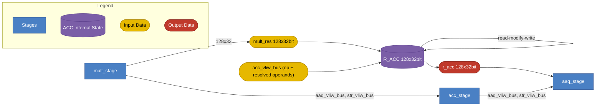

# Accumulator Stage

## 1. Purpose

The Accumulator (ACC) stage owns `R_ACC`, the 128-element accumulator
register, and combines each cycle's multiply result (`MULT_RES`, produced by
the MULT stage) into it. It is the third stage in the execute chain
(CTRL → MULT → **ACC** → AAQ → STORE) and produces:

- The updated 128-element `R_ACC`, forwarded to the AaQ stage.
- `aaq_vliw_bus` and `str_vliw_bus`, forwarded unchanged to the AAQ stage
  (see the Control Stage spec, §7.2).

Depending on the mnemonic, ACC either runs a per-element elementwise
reduction against `MULT_RES` (`ACC.ADD`/`MAX`/`SUB`), decimates and
reorders `MULT_RES` into a sub-range of `R_ACC` (`ACC.STRIDE`), reduces
all active `MULT_RES` elements to a single `R_ACC` word (`AGG.SUM`/`AGG.MAX`),
or scatters `MULT_RES` elements into `R_ACC` via `LRDn` index pairs (`ACC.RESHAPE`).

## 2. Block Diagram



## 3. Interfaces

`R_ACC` is **internal** to the ACC stage (owned register, read-modify-write
each cycle), analogous to how CR/LR are internal to CTRL. It is not
directly writable from outside ACC; the only way to set it is via an
ACC-slot instruction.

### 3.0 Black Box Diagram

```
                         ┌──────────────────────────────────────┐
              clk  ─────>│                                      │
              rst  ─────>│                                      │
               op  ─────>│                                      │
         mult_res  ─────>│                                      │
  acc_vliw_bus operands ─>│             ACC Stage                ├────> r_acc            [127:0][31:0]
                         │      (owns R_ACC, 128x32bit)          │
     aaq_vliw_bus  ─────>│                                      ├────> aaq_vliw_bus      [AAQ_BUS_W-1:0]
      str_vliw_bus  ─────>│                                      ├────> str_vliw_bus      [STR_BUS_W-1:0]
                         └──────────────────────────────────────┘
```

`aaq_vliw_bus` and `str_vliw_bus` arrive from the MULT stage and are
forwarded unchanged to the AaQ stage (see the Control Stage spec, §7.2);
ACC does not read or modify their contents.

### 3.1 Inputs

| Name | Type and Direction | Description |
|------|--------------------|-------------|
| `clk` | `input logic` | Clock signal. |
| `rst` | `input logic` | Synchronous reset. Clears `R_ACC` to 0. |
| `op` | `input logic [3:0]` | Selects the ACC operation: `ACC_INST_OPCODE_ACC_ADD` = 0, `ACC_INST_OPCODE_ACC_ADD_FIRST` = 1, `ACC_INST_OPCODE_ACC_MAX` = 2, `ACC_INST_OPCODE_ACC_MAX_FIRST` = 3, `ACC_INST_OPCODE_ACC_SUB` = 4, `ACC_INST_OPCODE_ACC_SUB_FIRST` = 5, `ACC_INST_OPCODE_NOP` = 6, `ACC_INST_OPCODE_ACC_STRIDE` = 7, `ACC_INST_OPCODE_AGG_SUM_FIRST` = 8, `ACC_INST_OPCODE_AGG_SUM` = 9, `ACC_INST_OPCODE_AGG_MAX_FIRST` = 10, `ACC_INST_OPCODE_AGG_MAX` = 11, `ACC_INST_OPCODE_ACC_RESHAPE` = 12 (see §6 for the full opcode table; opcode = position in `instruction_spec.py`'s `"acc"` slot). |
| `mult_res` | `input logic [127:0][31:0]` | This cycle's multiply result from the MULT stage: 128 elements, each INT32 or FP32 depending on the active element dtype (INT8-mode multiplies produce INT32 products; FP8-mode multiplies produce FP32 products — see the MULT stage). |
| `resolved_operands` | `input logic [131:0]` | Opcode-dependent union payload packed onto `acc_vliw_bus` alongside `op`. CTRL resolves every CR/LR operand this instruction needs (see §5) and packs it in here before dispatch; ACC never reads the CR/LR register files itself. Width is sized to the opcode with the largest operand set (`ACC_INST_OPCODE_ACC_RESHAPE`, 132 bits); other opcodes use only their low bits, and the rest are don't-care. Layout per opcode is in §3.1.1. |
| `aaq_vliw_bus` | `input logic [AAQ_BUS_W-1:0]` | AAQ-slot bus, forwarded from MULT. Passed through unchanged (see Control Stage spec §7.2). |
| `str_vliw_bus` | `input logic [STR_BUS_W-1:0]` | STORE-slot bus, forwarded from MULT. Passed through unchanged. |

#### 3.1.1 `resolved_operands` Layout (parsed relative to `op`)

`resolved_operands` is a **union**, not a struct: since ACC executes exactly
one opcode per cycle, each opcode's operands are packed starting at bit 0
and reuse the same physical bits as every other opcode's operands would.
ACC parses the buffer using the field layout for the value of `op`
(see §6 for the opcode table); bits above a given opcode's own fields are
don't-care for that opcode.

##### No operands

`ACC_INST_OPCODE_ACC_ADD`, `ACC_INST_OPCODE_ACC_ADD_FIRST`,
`ACC_INST_OPCODE_ACC_MAX`, `ACC_INST_OPCODE_ACC_MAX_FIRST`,
`ACC_INST_OPCODE_ACC_SUB`, `ACC_INST_OPCODE_ACC_SUB_FIRST`,
`ACC_INST_OPCODE_NOP` — entire buffer is don't-care.

##### `ACC_INST_OPCODE_ACC_STRIDE`

| Bits | Field | Description |
|---|---|---|
| `[1:0]` | `elements_in_row` | Encoded row-width selector (0/1/2 → 16/32/64 elements per row); an immediate slot field, not CR/LR-resolved. |
| `[3:2]` | `horizontal_stride` | Encoded column-decimation mode (0/1/2 → off/on/on_inv); an immediate slot field, not CR/LR-resolved. |
| `[5:4]` | `vertical_stride` | Encoded row-decimation mode (0/1/2 → off/on/on_inv); an immediate slot field, not CR/LR-resolved. |
| `[7:6]` | `offset` | CTRL-resolved **live** value of the `offset` `LrIdx` operand, truncated to its low 2 bits — `offset % 4` is exactly those 2 bits since 4 is a power of 2, so no arithmetic is needed to derive them from the 32-bit `LR` register. 4 possible values; ACC multiplies by 32 (a shift) to get the `R_ACC` start index: `0`, `32`, `64`, or `96`. |

Total: 8 bits used (`[7:0]`); `[131:8]` is don't-care.

##### `ACC_INST_OPCODE_AGG_SUM_FIRST`, `ACC_INST_OPCODE_AGG_SUM`, `ACC_INST_OPCODE_AGG_MAX_FIRST`, `ACC_INST_OPCODE_AGG_MAX`

| Bits | Field | Description |
|---|---|---|
| `[6:0]` | `dest_slot` | CTRL-resolved **snapshot** value of the `dest_slot` `LrIdx` operand, truncated to its low 7 bits — `dest_slot % 128` is exactly those 7 bits since 128 is a power of 2. Range 0–127, directly addressing an `R_ACC` word. |
| `[14:7]` | `valid_elements` | The `valid_elements` field CTRL decodes out of the `cr_idx` `DstructureCrIdx` operand's `CR` register (8 bits, range 0–128); ACC clamps it to `min(valid_elements, 128)` itself. |

Total: 15 bits used (`[14:0]`); `[131:15]` is don't-care.

##### `ACC_INST_OPCODE_ACC_RESHAPE`

| Bits | Field | Description |
|---|---|---|
| `[63:0]` | `source` | CTRL-resolved **snapshot** value of the `source` `LrdIdx` operand — the concatenated `LR(n+1):LR(n)` pair, read as 8 byte elements (`source[0..7]`), each a `MULT_RES` word index. |
| `[127:64]` | `dest` | CTRL-resolved **snapshot** value of the `dest` `LrdIdx` operand — the concatenated `LR(n+1):LR(n)` pair, read as 8 byte elements (`dest[0..7]`), each an `R_ACC` word index. |
| `[131:128]` | `reshape_mask` | CTRL-resolved value of the `reshape_mask` `LrOrReshapeMaskImmediate` operand: the immediate value if the encoded field is `< RESHAPE_MASK_LR_OFFSET` (8), otherwise the value of `LR[encoded − RESHAPE_MASK_LR_OFFSET]`. Field width is derived from the shared union field at assembler-build time (currently 4 bits); ACC raises an error if this resolved value exceeds `RESHAPE_ELEMENT_COUNT` (8) rather than clamping it. |

Total: 132 bits used (`[131:0]`) — the widest opcode, so it sets the
buffer's overall width.

### 3.2 Outputs

| Name | Type and Direction | Description |
|------|--------------------|-------------|
| `r_acc` | `output logic [127:0][31:0]` | The updated 128-element accumulator, driven to the AaQ stage every cycle (see the AaQ spec, §3.1). |
| `aaq_vliw_bus` | `output logic [AAQ_BUS_W-1:0]` | Forwarded unchanged to the AaQ stage. |
| `str_vliw_bus` | `output logic [STR_BUS_W-1:0]` | Forwarded unchanged to the AaQ stage (AaQ forwards it again to STORE). |

## 4. Disclaimers

- The ACC slot executes once per VLIW cycle.
- Slot execution order within a VLIW word: CTRL → MULT → **ACC** → AaQ → STR.
- `NOP` performs no state changes (`R_ACC` unchanged).
- ACC never reads the CR/LR register files directly — every CR/LR-derived
  operand value (`valid_elements`, `partition`, resolved LR values, etc.)
  arrives pre-resolved on `acc_vliw_bus` from CTRL.

## 5. Data and Register Model

- `R_ACC` is **128 elements × 32 bits**, matching `MULT_RES`'s width and element
  count. (The hardware parameter for this count is named `LANES`.)
- Each element's numeric interpretation (INT32 vs FP32) tracks whatever format
  `MULT_RES` was produced in that cycle — ACC's ALU does not carry an
  independent dtype selector of its own.
- **No dedicated clear/reset instruction.** Initialization is done purely
  through the `.FIRST` mnemonic variants:
  - `X` (no suffix) — running accumulation: combines `MULT_RES` with the
    **previous** `R_ACC` value (read from the pre-cycle snapshot, so it does
    not see this same cycle's in-flight write).
  - `X.FIRST` — clean-init: overwrites `R_ACC` with a value derived purely
    from `MULT_RES`, ignoring whatever was previously in `R_ACC`.
  - This pairing applies to `ACC.ADD`/`ACC.ADD.FIRST`, `ACC.MAX`/`ACC.MAX.FIRST`,
    `ACC.SUB`/`ACC.SUB.FIRST`, and `AGG.SUM`/`AGG.SUM.FIRST`,
    `AGG.MAX`/`AGG.MAX.FIRST`.
- `AGG.SUM`/`AGG.MAX` (and their `.FIRST` variants) reduce **all active
  elements of `MULT_RES`** — not `R_ACC` — down to a single scalar, written
  into one `R_ACC` word at an LR-selected index. The active element count
  (`valid_elements`) and `partition` come from a `DstructureCrIdx` operand
  (`cr_idx`: any `CR0`–`CR15`, must be given explicitly; `CR15`
  conventionally holds dstructure config but is not an implicit default —
  see the CLAUDE.md project directives).
- **Historical note:** cross-element aggregation (`AGG.*`) was moved into the
  ACC slot specifically to remove a RAW hazard that existed when it lived
  in a separate AAQ-writable scalar register file consumed by MULT/ACC (see
  the Control Stage spec, §9).
- `ACC.RESHAPE` scatters `MULT_RES` elements into `R_ACC` at LR-pair-selected
  indices, rather than reducing `MULT_RES` elementwise or aggregating them.
  All of its reads come from the pre-instruction `MULT_RES` snapshot, so
  scattered elements do not chain within one instruction (an element whose
  destination equals another element's source resolves to the
  pre-instruction value). A participating `source[i]`/`dest[i]` outside
  `[0, 127]`, or a resolved `reshape_mask` greater than `RESHAPE_ELEMENT_COUNT`
  (8), raises an error rather than being silently skipped or clamped.

## 6. ISA: Instruction Reference

The opcode enum (`acc_inst_opcode_t`, package `ipu_instr_pkg`) is generated
from
[`instruction_spec.py`](../../../src/tools/ipu-common/src/ipu_common/instruction_spec.py)
by
[`gen_codegen.py`](../../../src/tools/ipu-as-py/src/ipu_as/gen_codegen.py).
Per the project's opcode-derivation rule, opcode = position within the
`"acc"` slot dict — the table below lists mnemonics in that exact order.

### 6.1 `ACC.ADD` (opcode 0): Accumulate Add

- **Summary:** Running add accumulation: add the multiply result into each `R_ACC` element.
- **Syntax:** `ACC.ADD`
- **Operands:** none.
- **Operation:**
  ```text
  for i in 0..127:
      R_ACC[i] += MULT_RES[i]
  ```
- **Example:** `ACC.ADD;;`

### 6.2 `ACC.ADD.FIRST` (opcode 1): Accumulate Add (First)

- **Summary:** Clean-init add: overwrite each `R_ACC` element with the multiply result, ignoring the previous `R_ACC`.
- **Syntax:** `ACC.ADD.FIRST`
- **Operands:** none.
- **Operation:**
  ```text
  for i in 0..127:
      R_ACC[i] = MULT_RES[i]
  ```
- **Example:** `ACC.ADD.FIRST;;`

### 6.3 `ACC.MAX` (opcode 2): Accumulate Max

- **Summary:** Running max accumulation: each `R_ACC` element takes the max of its current value and the multiply result.
- **Syntax:** `ACC.MAX`
- **Operands:** none.
- **Operation:**
  ```text
  for i in 0..127:
      R_ACC[i] = max(R_ACC[i], MULT_RES[i])
  ```
- **Example:** `ACC.MAX;;`

### 6.4 `ACC.MAX.FIRST` (opcode 3): Accumulate Max (First)

- **Summary:** Clean-init max: overwrite each `R_ACC` element unconditionally with the multiply result.
- **Syntax:** `ACC.MAX.FIRST`
- **Operands:** none.
- **Operation:**
  ```text
  for i in 0..127:
      R_ACC[i] = MULT_RES[i]   // unconditional overwrite
  ```
- **Example:** `ACC.MAX.FIRST;;`

### 6.5 `ACC.SUB` (opcode 4): Accumulate Subtract

- **Summary:** Running subtract accumulation: subtract the multiply result from each `R_ACC` element.
- **Syntax:** `ACC.SUB`
- **Operands:** none.
- **Operation:**
  ```text
  for i in 0..127:
      R_ACC[i] -= MULT_RES[i]
  ```
- **Example:** `ACC.SUB;;`

### 6.6 `ACC.SUB.FIRST` (opcode 5): Accumulate Subtract (First)

- **Summary:** Clean-init subtract: set each `R_ACC` element to the negated multiply result.
- **Syntax:** `ACC.SUB.FIRST`
- **Operands:** none.
- **Operation:**
  ```text
  for i in 0..127:
      R_ACC[i] = -MULT_RES[i]
  ```
- **Example:** `ACC.SUB.FIRST;;`

### 6.7 `NOP` (opcode 6): No Operation

- **Summary:** No operation for the ACC slot; `R_ACC` unchanged.
- **Syntax:** `NOP`
- **Operands:** none.

### 6.8 `ACC.STRIDE` (opcode 7): Accumulator Stride

- **Summary:** Reorder `MULT_RES` into `R_ACC` using horizontal/vertical stride decimation. Only the written `R_ACC` indices change; the rest of `R_ACC` is left unchanged.
- **Syntax:** `ACC.STRIDE elements_in_row, horizontal_stride, vertical_stride, offset`
- **Operands:**
  - `elements_in_row`: elements per row viewed over the 128-element `MULT_RES` — encoded 0/1/2 → 16/32/64 elements (`elements_per_row`, minimum 16).
  - `horizontal_stride`: column decimation mode — encoded 0/1/2 → `off`/`on`/`on_inv` (`on` keeps even-indexed columns per row, `on_inv` keeps odd-indexed columns).
  - `vertical_stride`: row decimation mode — encoded 0/1/2 → `off`/`on`/`on_inv` (`on` keeps even-indexed rows, `on_inv` keeps odd-indexed rows).
  - `offset`: `LR0`–`LR15` (`LrIdx`, live value); `(offset % 4) * 32` gives the start index in `R_ACC` (0, 32, 64, or 96).
- **Operation:**
  ```text
  rows = 128 / elements_per_row
  view MULT_RES as [rows][elements_per_row]
  if horizontal_stride enabled: keep every 2nd column per row (parity per on/on_inv)
  if vertical_stride enabled:   keep every 2nd row (parity per on/on_inv)
  N = 128 >> (horizontal_stride_enabled + vertical_stride_enabled)   // 128, 64, or 32
  start = (offset % 4) * 32
  R_ACC[start : start + N] = decimated MULT_RES, row-major
  ```
- **Example:** `ACC.STRIDE 16, off, off, LR0;;`
- **Notes:** when a data structure has fewer than 8 elements, hardware pads to 16 automatically (not programmable).

### 6.9 `AGG.SUM.FIRST` (opcode 8): Aggregate Sum (First)

- **Summary:** Sum active `MULT_RES` elements and write the result into `R_ACC` at the slot given by `LR[dest_slot]`. The current value at the destination slot is **not** included (clean initialization).
- **Syntax:** `AGG.SUM.FIRST dest_slot, cr_idx`
- **Operands:**
  - `dest_slot`: `LR0`–`LR15` (`LrIdx`, snapshot value) — its value gives the destination slot in `R_ACC` (0–127).
  - `cr_idx`: `CR0`–`CR15` (`DstructureCrIdx`, must be given explicitly) — supplies `valid_elements`.
- **Operation:**
  ```text
  n = min(CR[cr_idx].valid_elements, 128)
  dest = LR[dest_slot] % 128
  R_ACC[dest] = sum(MULT_RES[0..n-1])
  ```
- **Example:** `AGG.SUM.FIRST LR0, CR3;;`

### 6.10 `AGG.SUM` (opcode 9): Aggregate Sum

- **Summary:** Sum active `MULT_RES` elements and add the result to `R_ACC` at the slot given by `LR[dest_slot]` (running cross-cycle accumulation).
- **Syntax:** `AGG.SUM dest_slot, cr_idx`
- **Operands:** identical to `AGG.SUM.FIRST`.
- **Operation:**
  ```text
  n = min(CR[cr_idx].valid_elements, 128)
  dest = LR[dest_slot] % 128
  R_ACC[dest] = sum(MULT_RES[0..n-1]) + R_ACC[dest]
  ```
- **Example:** `AGG.SUM LR0, CR3;;`

### 6.11 `AGG.MAX.FIRST` (opcode 10): Aggregate Max (First)

- **Summary:** Find the maximum of active `MULT_RES` elements and write it into `R_ACC` at the slot given by `LR[dest_slot]`. The current destination value is **not** used as a seed.
- **Syntax:** `AGG.MAX.FIRST dest_slot, cr_idx`
- **Operands:** identical to `AGG.SUM.FIRST`.
- **Operation:**
  ```text
  n = min(CR[cr_idx].valid_elements, 128)
  dest = LR[dest_slot] % 128
  R_ACC[dest] = max(MULT_RES[0..n-1])
  // when n = 0: identity seed (INT32_MIN for integer elements, -inf for float elements)
  ```
- **Example:** `AGG.MAX.FIRST LR0, CR3;;`

### 6.12 `AGG.MAX` (opcode 11): Aggregate Max

- **Summary:** Find the maximum of active `MULT_RES` elements seeded with the current destination slot value (running cross-cycle max).
- **Syntax:** `AGG.MAX dest_slot, cr_idx`
- **Operands:** identical to `AGG.SUM.FIRST`.
- **Operation:**
  ```text
  n = min(CR[cr_idx].valid_elements, 128)
  dest = LR[dest_slot] % 128
  R_ACC[dest] = max(MULT_RES[0..n-1], R_ACC[dest])
  ```
- **Example:** `AGG.MAX LR0, CR3;;`

### 6.13 `ACC.RESHAPE` (opcode 12): Reshape

- **Summary:** Scatter `MULT_RES` elements into `R_ACC`: for each of the trailing `(8 - reshape_mask)` byte elements of the `source`/`dest` `LRDn` pairs (indices `reshape_mask..7`), copy `MULT_RES[source[i]]` to `R_ACC[dest[i]]`.
- **Syntax:** `ACC.RESHAPE source, dest, reshape_mask`
- **Operands:**
  - `source`: `LRD0`, `LRD2`, …, `LRD14` (`LrdIdx`, snapshot value) — read as `source[0..7]`, 8 byte elements, each a `MULT_RES` word index.
  - `dest`: `LRD0`, `LRD2`, …, `LRD14` (`LrdIdx`, snapshot value) — read as `dest[0..7]`, 8 byte elements, each an `R_ACC` word index.
  - `reshape_mask`: immediate 0–7 or an LR register (`LrOrReshapeMaskImmediate`) — selects the first participating element index; elements `reshape_mask..7` participate (`reshape_mask = 0` uses all 8, `reshape_mask = 7` uses only element 7, `reshape_mask = 8` uses none). When an LR is given, its value is used directly as the mask (not truncated).
- **Operation:**
  ```text
  mult_res = MULT_RES   // pre-instruction snapshot
  mask = reshape_mask if immediate else LR[reshape_mask]
  if mask > 8: raise error
  for i in mask..7:
      if source[i] >= 128 or dest[i] >= 128: raise error
      R_ACC[dest[i]] = mult_res[source[i]]
  ```
- **Example:** `ACC.RESHAPE LRD0, LRD2, 0;;`
- **Notes:** `reshape_mask` skips the lowest-indexed elements `0..reshape_mask-1`; the rest participate. **Example:** `reshape_mask = 2` skips elements 0, 1; elements 2-7 participate. **Example:** `reshape_mask = 5` skips elements 0-4; elements 5-7 participate.

### 6.14 Summary Table

| Opcode | Mnemonic | Operands | One-line Effect |
|--------|----------|----------|-----------------|
| 0 | `ACC.ADD` | - | `R_ACC[i] += MULT_RES[i]` |
| 1 | `ACC.ADD.FIRST` | - | `R_ACC[i] = MULT_RES[i]` |
| 2 | `ACC.MAX` | - | `R_ACC[i] = max(R_ACC[i], MULT_RES[i])` |
| 3 | `ACC.MAX.FIRST` | - | `R_ACC[i] = MULT_RES[i]` (unconditional) |
| 4 | `ACC.SUB` | - | `R_ACC[i] -= MULT_RES[i]` |
| 5 | `ACC.SUB.FIRST` | - | `R_ACC[i] = -MULT_RES[i]` |
| 6 | `NOP` | - | no state change |
| 7 | `ACC.STRIDE` | `elements_in_row, horizontal_stride, vertical_stride, offset` | decimate `MULT_RES` into `R_ACC[start:start+N]` |
| 8 | `AGG.SUM.FIRST` | `dest_slot, cr_idx` | `R_ACC[dest] = sum(MULT_RES[0..n-1])` |
| 9 | `AGG.SUM` | `dest_slot, cr_idx` | `R_ACC[dest] += sum(MULT_RES[0..n-1])` |
| 10 | `AGG.MAX.FIRST` | `dest_slot, cr_idx` | `R_ACC[dest] = max(MULT_RES[0..n-1])` |
| 11 | `AGG.MAX` | `dest_slot, cr_idx` | `R_ACC[dest] = max(MULT_RES[0..n-1], R_ACC[dest])` |
| 12 | `ACC.RESHAPE` | `source, dest, reshape_mask` | scatter `MULT_RES` elements into `R_ACC` per `LRDn` index pairs |
